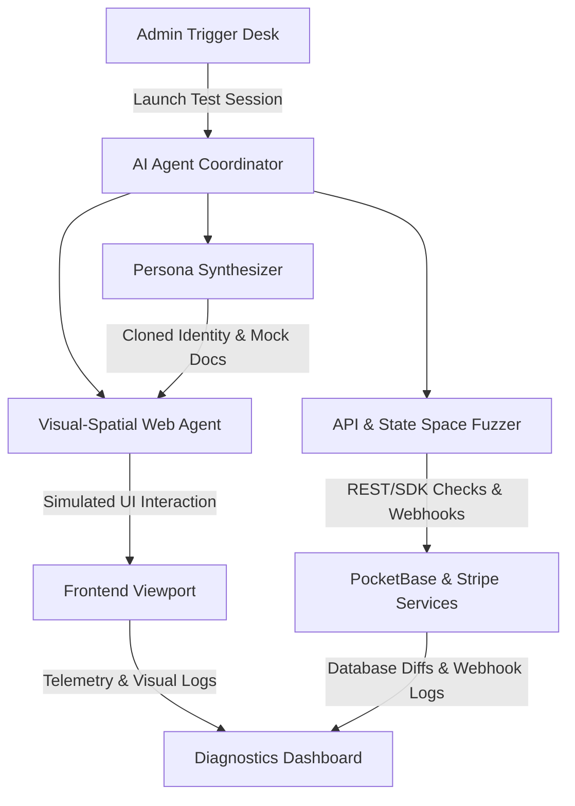

# AI Testing Agent Specifications
**Atlanta TV Mount PRO · Autonomous QA & Simulation System (2030 Specifications)**

This document details the architecture, persona assimilation engine, execution parameters, and interface guidelines for the **AI Testing Agent**—an autonomous quality assurance agent designed to simulate user behavior and validate end-to-end functionality on both the front and backend of the Atlanta TV Mount PRO platform.

---

## 1. 2030 Technology Stack

To achieve absolute verification coverage without maintaining brittle, easily broken testing scripts, the AI Testing Agent utilizes state-of-the-art 2030 agentic testing technologies:



### A. Multimodal Visual-Spatial Web Agent (VSA)
* **Description**: Instead of relying on traditional DOM selectors (ID, class, XPath) which break with minor styling or structural changes, the agent utilizes a visual-spatial model. It visually analyzes the page viewport and interacts with elements based on semantic understanding.
* **Core Capabilities**:
  * **Element Detection**: Automatically identifies form fields, buttons, sliders, modals, and close triggers by visual appearance.
  * **Self-Healing Flow Graphs**: If a button (e.g., "Add to Cart") changes location, style, or becomes nested in a drawer, the agent dynamically re-maps its navigation path by understanding the context of the goal.
  * **Natural Language Navigation**: Interacts with the interface using goal statements, e.g., *"Find the basic TV mounting service, select a 55-inch TV, schedule for tomorrow, and complete checkout."*

### B. Generative Persona Synthesizer
* **Description**: Synthesizes and clones highly realistic user personas to simulate actual human interactions, including typical user errors, input variations, and network speeds.
* **Generative Mocking**:
  * **Input Synthesis**: Generates unique names, phone numbers, addresses, vehicle descriptions, and booking notes.
  * **Document Synthesizer**: Generates mock PDF and JPEG attachments (e.g., mock driver's licenses, liability insurance files, and background check consents) that bypass OCR validations in the recruit onboarding pipeline.

### C. State Space & API Fuzzer
* **Description**: Evaluates backend robustness by testing endpoints directly while the frontend agent interacts with the UI.
* **Capabilities**:
  * **Webhook Interception**: Captures, validates, and simulates delayed or failed Stripe webhook dispatches to test payment recovery loops.
  * **Concurrency Tests**: Simulates double-booking requests, parallel admin edits, and rapid-fire API commands to verify PocketBase row locks and ledger consistency.

---

## 2. User Assimilation Models (Personas)

The agent operates by choosing one or more of the following target personas to execute their specific application loops:

| Persona | Target Workflows | Expected Output |
| :--- | :--- | :--- |
| **Customer** | Pricing estimations, service scheduling, Stripe sandbox checkout, store purchases, support ticket filing. | Correct invoice creation, ledger balancing, support desk auto-linking. |
| **Active Technician** | Route navigation, check-in/out stamps, uniform shop purchasing, paycheck commission deductions, availability changes. | Correct earnings ledger updates, uniform shipment logs in database. |
| **Onboarding Recruit** | Pre-approval application submission, double opt-in email bypass verification, liability insurance uploads, handbook quiz completion. | Table state transitions from `recruit` to `approved_tech`. |
| **System Administrator** | Financial dashboard metrics analysis, user role modifications, Stripe refunds (full/partial), support ticket triaging, testing trigger desks. | Event audits logged, Stripe API refunds processed, database schema changes verified. |

---

## 3. Dual-Mode Execution Boundaries

The agent operates under strict boundary gates depending on the target environment to prevent data contamination:

### A. Local & Staging Sandbox Mode
* **Goal**: Maximize code coverage, test destructive actions, and verify edge-case recovery.
* **Capabilities**:
  * **Database Resets**: The agent is authorized to perform complete database wipes and seed cycles.
  * **Mock Integrations**: Replaces outbound Stripe/SMTP calls with mock loopbacks, verifying correct payloads are generated without contacting third-party APIs.
  * **Time-Warping**: Speeds up clock times to test chronological events (e.g. verifying that escrow payouts unlock exactly 48 hours post-service completion).

### B. Production Smoke Testing Mode
* **Goal**: Validate production deployments without contaminating real metrics or generating erroneous transactions.
* **Safety Gates**:
  * **Transactional Bypass**: The agent uses designated read-only actions for store and booking flows.
  * **Identifiable Mock Data**: Any entries logged in production (such as a smoke-test support ticket) must be prefixed with `[SYSTEM-SMOKE]` and contain a self-destruct flag.
  * **Immediate Clean-Up**: A post-test webhook immediately triggers a database script to purge the smoke data and restore ledger metrics.

---

## 4. Backend Admin Control Desk

Rather than requiring CLI execution, the AI Testing Agent is controlled via an interactive dashboard in the backend admin panel.

```
+----------------------------------------------------------------------------+
|  AI TESTING AGENT TRIGGER DESK                                             |
+----------------------------------------------------------------------------+
|  [Select Environment: [ Staging / Sandbox | Production Smoke ] ]           |
|  [Select Persona:     [ Customer / Tech / Recruit / Admin / All ] ]        |
|                                                                            |
|  +---------------------------+   +--------------------------------------+  |
|  | LIVE VISUAL TRAVERSAL     |   | RUN TELEMETRY & LOGS                 |  |
|  |                           |   |                                      |  |
|  | +-----------------------+ |   | [09:12:02] Synthesized Customer: Bob |  |
|  | |                       | |   | [09:12:05] Navigating to /store      |  |
|  | | [Visual Web Viewport] | |   | [09:12:09] Added Polo Shirt to Cart  |  |
|  | |                       | |   | [09:12:12] Stripe Checkout - Sandbox |  |
|  | +-----------------------+ |   | [09:12:15] Webhook fired - Success   |  |
|  +---------------------------+   +--------------------------------------+  |
|                                                                            |
|  [ RUN TEST SWEEP ]                       [ STOP / CANCEL ]                |
+----------------------------------------------------------------------------+
```

### Interface Specifications & Features:
1. **Live Viewport Stream**: Renders a canvas displaying the real-time visual traversal of the agent's web view, showing where the agent is looking, clicking, and typing.
2. **Execution Parameters**:
   - **Environment Toggle**: Switches boundaries between sandbox and smoke modes.
   - **Persona Selectors**: Choose specific personas to run individual loops or execute a full suite sweep.
   - **Simulation Speed**: Sliders to toggle between instant execution (max speed) or real-time simulation (human reading speeds for debugging).
3. **Interactive Test Report**:
   - Logs database diffs (before and after operations).
   - Flagged anomalies (e.g. slow API response times, unhandled UI layout shifts).
   - Diagnostic exports containing session video recordings and console logs.
