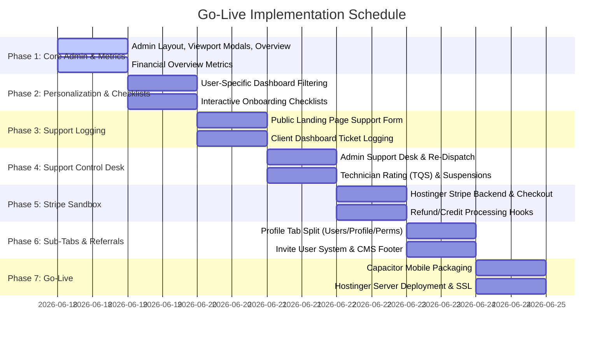

# Go-Live Plan & Launch Readiness Roadmap
**Atlanta TV Mount PRO · Production Launch Plan**

This document outlines the comprehensive go-live roadmap, daily schedule, and checklist for deploying the Atlanta TV Mount PRO platform, including personalized dashboards, recruitment onboarding flows, and the technical support/accountability ecosystem.

---

## 1. Daily Implementation Schedule

To ensure a smooth release and keep changes manageable, development is structured into a **7-Day Schedule** mapping the core and support components:

### Day 1: Core Admin & Metrics (Completed)
- **Modals Viewport Boundaries**: Configured max height (`max-h-[90vh]`) and vertical scrollbar rules on all dialogs in [AdminPage.jsx](file:///C:/Users/judit/workspace/atltvmountpro_main/atltvmountpro-main/src/pages/AdminPage.jsx) (`TechFormDialog`, `UserFormDialog`, `editingOrder`, `selectedOrder`, and `selectedApplication`).
- **Overview Dashboard tab**: Created the default landing tab in the admin panel layout.
- **Financial Analytics Panel**: Integrated Gross Revenue, Number of Sales (Paid Invoices), Average Sale Value, and Outstanding Balance calculations, fully filterable by the timeframe dropdown selector.

### Day 2: Personalization & Onboarding Checklists
- **Dashboard Personalization**: Segment the Client Dashboard (`ClientDashboard.jsx`) to load views relevant to the user type:
  - **Customers**: Active and past bookings, invoicing receipts, and ticket options.
  - **Active Technicians**: Assigned daily routes, earnings tables, and availability scheduler.
  - **Recruits**: Step-by-step onboarding progress trackers.
- **Interactive Checklists**: 
  - **Pre-Approval checklist**: Submit Application status, double opt-in email check, background check consent, identity card photo upload, and phone screening status.
  - **Post-Approval checklist**: Safety handbook quiz, payout accounts settings, liability insurance upload, and bio photo setup.

### Day 3: Support Ticket Submission & Auto-Matching
- **Public Support Route (`/support`)**: Add a public support page with a clean form (Name, Email, Phone, Booking ID, Category, Description, and photo attachments) accessible from the landing page.
- **Intelligent Auto-Matching**: Match submitted tickets against active bookings by Email/Booking ID, linking them automatically to the booking and original technician. Unmatched entries are flagged as "unlinked" for manual admin triaging.
- **Header & Footer Links**: Update navigation headers and footers to link to `/support`.

### Day 4: Admin Support Desk & Performance Suspension
- **Admin Support Panel**: Create a dedicated Support Desk tab inside the admin portal sidebar to view, manage, and close tickets.
- **TQS Scoring & Accountability**: Linked ticket category results to deduct Technician Quality Score (TQS) points (e.g. -10 for workmanship complaints, -25 for no-shows).
- **Auto-Suspension Gate**: If a technician's score drops below 75 or they receive 2 complaints within 30 days, flag their profile `isSuspended: true`, locking them out of accepting bookings.
- **Re-Dispatch repair**: Provide options to assign repair jobs to another technician, issuing a premium repair payout.

### Day 5: Payments, Escrow & Refund Hooks
- **Stripe Checkout Sandbox**: Connect the checkout flows and Hostinger Stripe webhooks.
- **Escrow Hold lock**: Place payouts in escrow for 48 hours post-service. If an issue is logged, freeze the technician payout until ticket resolution.
- **Refund Hooks**: Trigger Stripe API refunds from the Admin support screen (full or partial) and update ledger entries.

### Day 6: Profile Segmentation & Referrals
- **Sub-Tabs Division**: Split the Admin "Profile & Users" tab into three distinct views:
  - **Users**: List of all system users with full editing capabilities.
  - **Profile**: Private admin card showing personal details and master key resets.
  - **Permissions**: granual checkbox access controls.
- **Invite Referral System**: Prefilled invite links for technicians to join the team, shared via SMS, WhatsApp, or email.

### Day 7: Mobile Apps & Live Hostinger Deploy
- **Mobile Packaging**: Set up Capacitor configuration and link App Store and Google Play badges on the homepage.
- **Production Server setup**: Deploy build assets to Hostinger via Git pipelines, enable SSL certificate paths, and set up database backups.

---

## 2. Launch Readiness Checklist

- [ ] Production compilation (`npm run build`) completes successfully.
- [ ] Connect PocketBase server with live API credentials (`VITE_POCKETBASE_API_URL`).
- [ ] Verify SSL configurations and Hostinger Node.js application startup files.
- [ ] Run backend migrations to create the `support_tickets` and `onboarding_status` tables.
- [ ] Seed base system users (Admins, Accountants, Moderators) with custom dashboard permissions.
- [ ] Set Stripe variables (`VITE_STRIPE_PUBLIC_KEY`) in the client `.env` files.
